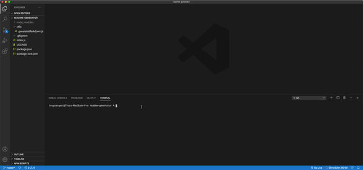

# Readme Generator  
  This is a CLI interface that generates readme's from user inputs.
  ## Demo
   
  ## Table of Contents
  - [Installation](#Installation)
  - [Usage](#Usage)
  - [License](#License)
  ## Installation
  ```git clone git@github.com:TroySargent/README-generator.git```
  ## Usage
  ```
  npm install
  node index.js
  ```
  [See the example template to see how the output looks](Example_README.md)
  ## License
  This project is licensed under the MIT license.
  ### [Check out my other projects](https://github.com/TroySargent)
